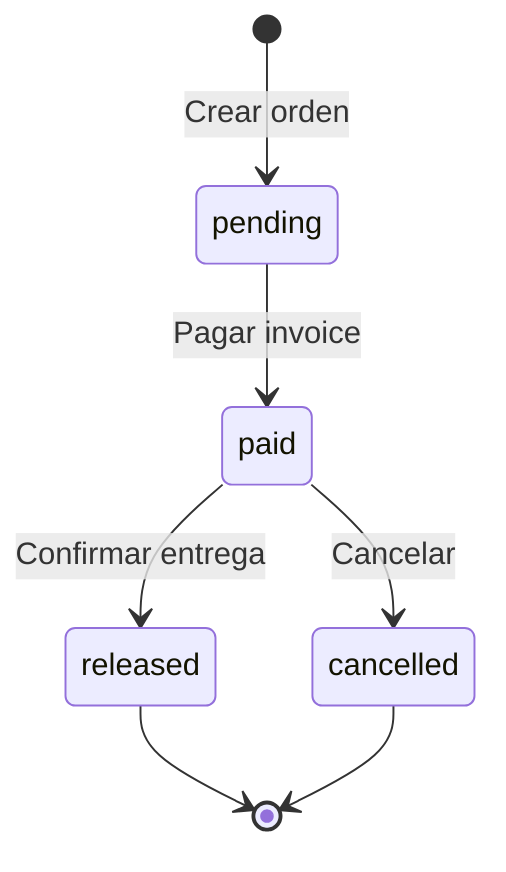

# 🏗️ TurboZaps - Arquitectura del Sistema

## 📐 Diagrama General

```
┌─────────────────────────────────────────────────────────────────┐
│                      FRONTEND (Next.js 14)                      │
├─────────────────────────────────────────────────────────────────┤
│                                                                 │
│  ┌──────────────┐  ┌──────────────┐  ┌──────────────┐         │
│  │   Landing    │  │   Register   │  │  Select Role │         │
│  │     Page     │  │  Merchant/   │  │              │         │
│  │              │  │    Buyer     │  │              │         │
│  └──────────────┘  └──────────────┘  └──────────────┘         │
│                                                                 │
│  ┌──────────────┐  ┌──────────────┐  ┌──────────────┐         │
│  │  Marketplace │  │  Product     │  │    Sell      │         │
│  │   (Browse)   │  │   Detail     │  │ (Merchant)   │         │
│  │              │  │  + Purchase  │  │              │         │
│  └──────────────┘  └──────────────┘  └──────────────┘         │
│                                                                 │
│  ┌──────────────┐  ┌──────────────┐                           │
│  │  Dashboard   │  │  Dashboard   │                           │
│  │    Buyer     │  │   Seller     │                           │
│  │              │  │              │                           │
│  └──────────────┘  └──────────────┘                           │
│                                                                 │
└─────────────────────────────────────────────────────────────────┘
                             │
                             ↓
┌─────────────────────────────────────────────────────────────────┐
│                   API ROUTES (Next.js)                          │
├─────────────────────────────────────────────────────────────────┤
│                                                                 │
│  /api/merchants      → Crear/Obtener merchant                  │
│  /api/stalls         → Crear/Obtener stalls                    │
│  /api/customers      → Crear/Obtener buyers                    │
│  /api/products       → CRUD de productos                       │
│  /api/orders         → Crear/Listar órdenes                    │
│  /api/orders/[id]    → Obtener/Actualizar orden               │
│  /api/orders/[id]/release → Liberar escrow                     │
│  /api/orders/[id]/refund  → Devolver fondos                    │
│  /api/chat           → Mensajes P2P                            │
│                                                                 │
└─────────────────────────────────────────────────────────────────┘
                             │
                             ↓
┌─────────────────────────────────────────────────────────────────┐
│                        BUSINESS LOGIC                           │
├─────────────────────────────────────────────────────────────────┤
│                                                                 │
│  lib/lnbits.ts       → Wrapper API LNbits                      │
│  lib/db.ts           → Acceso a SQLite                         │
│  lib/config.ts       → Configuración                           │
│  lib/utils.ts        → Utilidades                              │
│                                                                 │
└─────────────────────────────────────────────────────────────────┘
          │                              │
          ↓                              ↓
┌─────────────────────┐    ┌───────────────────────────┐
│   SQLite (Local)    │    │  LNbits NostrMarket API   │
├─────────────────────┤    ├───────────────────────────┤
│                     │    │                           │
│  products           │    │  /merchant                │
│  orders             │    │  /stall                   │
│  messages           │    │  /product                 │
│                     │    │  /order                   │
│                     │    │  /message                 │
│                     │    │  /customer                │
│                     │    │                           │
└─────────────────────┘    └───────────────────────────┘
                                      │
                                      ↓
                           ┌─────────────────────┐
                           │  Lightning Network  │
                           │   + Nostr Protocol  │
                           └─────────────────────┘
```

---

## 🔄 Flujo de Datos: Crear Producto

```
[Merchant UI]
    │ POST /api/products
    │ { stall_id, name, price, ... }
    ↓
[API Route: /api/products]
    │ Valida datos
    │ Guarda en SQLite local
    ↓
[lib/lnbits.ts: createLNbitsProduct()]
    │ POST /nostrmarket/api/v1/product
    │ Headers: X-API-Key
    ↓
[LNbits NostrMarket]
    │ Crea producto
    │ Publica en Nostr
    ↓
[Respuesta]
    │ { product_id, ... }
    ↓
[Frontend actualiza UI]
```

---

## 🔄 Flujo de Datos: Compra y Escrow

```
[Buyer UI: Product Detail]
    │ Click "Comprar"
    │ POST /api/orders
    │ { product_id, buyer_pubkey }
    ↓
[API Route: /api/orders]
    │ Valida buyer registrado
    │ Obtiene producto de DB
    │ Calcula total
    ↓
[lib/lnbits.ts: createLightningInvoice()]
    │ POST /api/v1/payments (LNbits API directo, NO NostrMarket)
    │ { amount, memo, order_id }
    ↓
[LNbits Wallet API]
    │ Genera Lightning Invoice
    │ { payment_request, payment_hash }
    ↓
[SQLite]
    │ INSERT INTO orders
    │ payment_request, payment_hash
    │ status = 'pending'
    ↓
[Frontend: Lightning Modal]
    │ Muestra QR Code
    │ Muestra payment_request
    │ Comprador escanea y paga
    ↓
[Buyer paga via Lightning Wallet]
    │ Fondos → LNbits Wallet (escrow local)
    ↓
[Buyer: "Ya pagué"]
    │ PATCH /api/orders/{id}
    │ { paid: true }
    ↓
[LNbits]
    │ (Opcional) Verifica pago via payment_hash
    │ Confirma recepción
    ↓
[SQLite]
    │ UPDATE orders SET status = 'paid'
    ↓
[Frontend]
    │ Muestra "Pago en escrow"
    │ Habilita chat
```

> **Nota Importante:** NostrMarket **no tiene endpoint POST /order**. Las órdenes se crean localmente y los invoices se generan usando la API de wallet de LNbits directamente.

---

## 🔄 Flujo de Datos: Chat P2P

```
[Buyer/Seller UI: EscrowChat]
    │ Escribe mensaje
    │ POST /api/chat
    │ { order_id, message, sender_pubkey }
    ↓
[API Route: /api/chat]
    │ Obtiene orden
    │ Identifica recipient_pubkey
    ↓
[lib/lnbits.ts: sendLNbitsMessage()]
    │ POST /nostrmarket/api/v1/message
    │ { message, public_key }
    ↓
[LNbits NostrMarket]
    │ Cifra mensaje (NIP-04)
    │ Publica en Nostr
    ↓
[SQLite]
    │ INSERT INTO messages (cache local)
    ↓
[Otro usuario hace polling]
    │ GET /api/chat?order_id={id}
    ↓
[API Route: /api/chat]
    │ GET /nostrmarket/api/v1/message/{pubkey}
    ↓
[LNbits]
    │ Obtiene mensajes de Nostr
    │ Descifra mensajes
    ↓
[Frontend: EscrowChat]
    │ Muestra mensajes
    │ Polling cada 5s
```

---

## 🔄 Flujo de Datos: Liberar Fondos

```
[Buyer UI: Product Detail]
    │ Click "Confirmar entrega"
    │ POST /api/orders/{id}/release
    ↓
[API Route: /api/orders/[id]/release]
    │ Valida orden
    │ Verifica status = 'paid'
    ↓
[lib/lnbits.ts: releaseEscrow()]
    │ PATCH /nostrmarket/api/v1/order/{id}
    │ { paid: true, shipped: true }
    ↓
[LNbits]
    │ Libera fondos del escrow
    │ Transfiere al seller
    ↓
[SQLite]
    │ UPDATE orders SET status = 'released'
    ↓
[Frontend]
    │ Muestra "Pago liberado"
    │ Badge verde ✅
```

---

## 🗄️ Esquema de Base de Datos (SQLite)

### Tabla: products

```sql
CREATE TABLE products (
  id TEXT PRIMARY KEY,
  stall_id TEXT NOT NULL,
  name TEXT NOT NULL,
  price INTEGER NOT NULL,
  categories TEXT, -- JSON array
  images TEXT,     -- JSON array
  config TEXT,     -- JSON object
  created_at TIMESTAMP DEFAULT CURRENT_TIMESTAMP
);
```

### Tabla: orders

```sql
CREATE TABLE orders (
  id TEXT PRIMARY KEY,
  product_id TEXT NOT NULL,
  buyer_pubkey TEXT NOT NULL,
  seller_pubkey TEXT,
  payment_request TEXT,
  status TEXT CHECK(status IN ('pending', 'paid', 'released', 'cancelled')),
  total_sats INTEGER NOT NULL,
  created_at TIMESTAMP DEFAULT CURRENT_TIMESTAMP,
  updated_at TIMESTAMP DEFAULT CURRENT_TIMESTAMP
);
```

### Tabla: messages

```sql
CREATE TABLE messages (
  id TEXT PRIMARY KEY,
  order_id TEXT NOT NULL,
  sender_pubkey TEXT NOT NULL,
  recipient_pubkey TEXT NOT NULL,
  message TEXT NOT NULL,
  timestamp TIMESTAMP DEFAULT CURRENT_TIMESTAMP
);
```

---

## 🔐 Autenticación y Seguridad

### LNbits API

```typescript
Headers: {
  'X-API-Key': process.env.LNBITS_API_KEY,
  'Content-Type': 'application/json'
}
```

### Nostr Keys

```typescript
// Merchant
{
  private_key: "nsec1...",  // Nunca exponer al frontend
  public_key: "npub1..."    // OK para frontend
}

// Buyer
{
  public_key: "npub1..."    // Solo necesita pública
}
```

### LocalStorage (Frontend)

```javascript
localStorage.setItem('merchant_id', '...')
localStorage.setItem('merchant_npub', 'npub1...')
localStorage.setItem('stall_id', '...')
localStorage.setItem('buyer_pubkey', 'npub1...')
```

---

## 🧩 Componentes Principales

### ProductDetail

```typescript
// Gestiona el flujo completo de compra
const ProductDetail = () => {
  // 1. Muestra producto
  // 2. Botón "Comprar"
  // 3. Crea orden → Lightning Modal
  // 4. Confirma pago → Escrow status
  // 5. Chat P2P
  // 6. Botones Confirmar/Cancelar
}
```

### LightningPaymentModal

```typescript
// Muestra invoice Lightning
const LightningPaymentModal = ({ invoice, amount }) => {
  // 1. QR Code (invoice)
  // 2. Copy button (invoice)
  // 3. Monto en sats
  // 4. Botón "Ya pagué"
}
```

### EscrowChat

```typescript
// Chat P2P vía Nostr
const EscrowChat = ({ orderId, buyerPubkey, sellerPubkey }) => {
  // 1. Fetch messages (polling 5s)
  // 2. Send message → LNbits
  // 3. Muestra mensajes
  // 4. Badge de estado
}
```

---

## 📊 Estados de Orden



---

## 🔗 Endpoints LNbits NostrMarket

### Merchants

- `POST /merchant` → Crear merchant
- `GET /merchant` → Obtener merchant

### Stalls

- `POST /stall` → Crear stall
- `GET /stall` → Listar stalls
- `GET /stall/{id}` → Obtener stall

### Products

- `POST /product` → Crear producto
- `GET /product/{id}` → Obtener producto
- `GET /stall/product/{stall_id}` → Productos por stall

### Orders

- `GET /order` → Listar órdenes
- `GET /order/{id}` → Obtener orden
- `PATCH /order/{id}` → Actualizar orden

### Messages

- `POST /message` → Enviar mensaje
- `GET /message/{public_key}` → Obtener mensajes

### Customers

- `POST /customer` → Crear customer
- `GET /customer` → Listar customers

---

## 🚀 Despliegue

### Producción

```bash
# Build
pnpm build

# Start
pnpm start

# Variables de entorno
LNBITS_URL=https://tu-lnbits.com
LNBITS_API_KEY=production_key
DATABASE_URL=./turbozaps.db
```

### Docker (opcional)

```dockerfile
FROM node:20-alpine
WORKDIR /app
COPY package*.json ./
RUN pnpm install
COPY . .
RUN pnpm build
EXPOSE 3000
CMD ["pnpm", "start"]
```

---

## 📈 Métricas y Monitoreo

### Logs importantes

```typescript
// lib/lnbits.ts
console.log('[LNbits API] POST /merchant')
console.log('[LNbits API] Response:', data)

// API Routes
console.log('[API /orders] Creating order:', { product_id, buyer_pubkey })
console.log('[API /orders] Order created:', order_id)
```

### Errores comunes

1. **404 Endpoint not found** → Verifica LNBITS_URL
2. **401 Unauthorized** → Verifica LNBITS_API_KEY
3. **Missing stall_id** → Usuario no registrado como merchant

---

## 🧪 Testing

### Unit Tests (futuro)

```typescript
// lib/lnbits.test.ts
describe('createMerchant', () => {
  it('should create merchant in LNbits', async () => {
    // ...
  })
})
```

### Integration Tests (futuro)

```typescript
// e2e/purchase-flow.test.ts
describe('Purchase Flow', () => {
  it('should complete full escrow flow', async () => {
    // 1. Create merchant
    // 2. Create product
    // 3. Create buyer
    // 4. Purchase product
    // 5. Pay invoice
    // 6. Chat
    // 7. Release escrow
  })
})
```

---

## 🎯 Consideraciones de Escalabilidad

### Base de datos

- SQLite OK para MVP
- Para producción: PostgreSQL
- Usar indexes en `buyer_pubkey`, `product_id`, `order_id`

### Chat

- Polling actual: simple pero no escala
- Futuro: WebSockets o Server-Sent Events
- O usar Nostr relays directamente desde frontend

### Lightning

- LNbits maneja la escalabilidad Lightning
- Considerar múltiples nodos para redundancia

---

## 🔮 Arquitectura Futura

```
┌──────────────┐
│   Frontend   │
│   (Next.js)  │
└──────┬───────┘
       │
       ↓
┌──────────────┐
│  API Gateway │
│   (tRPC?)    │
└──────┬───────┘
       │
       ├─→ ┌──────────────┐
       │   │  Auth Service│
       │   │   (Nostr)    │
       │   └──────────────┘
       │
       ├─→ ┌──────────────┐
       │   │Product Service│
       │   │  (NostrMarket)│
       │   └──────────────┘
       │
       ├─→ ┌──────────────┐
       │   │ Order Service│
       │   │  (Lightning) │
       │   └──────────────┘
       │
       └─→ ┌──────────────┐
           │  Chat Service│
           │    (Nostr)   │
           └──────────────┘
```

---

**Última actualización:** 12 de noviembre, 2025  
**Equipo:** TurboZaps ⚡  
**Estado:** MVP Completo

